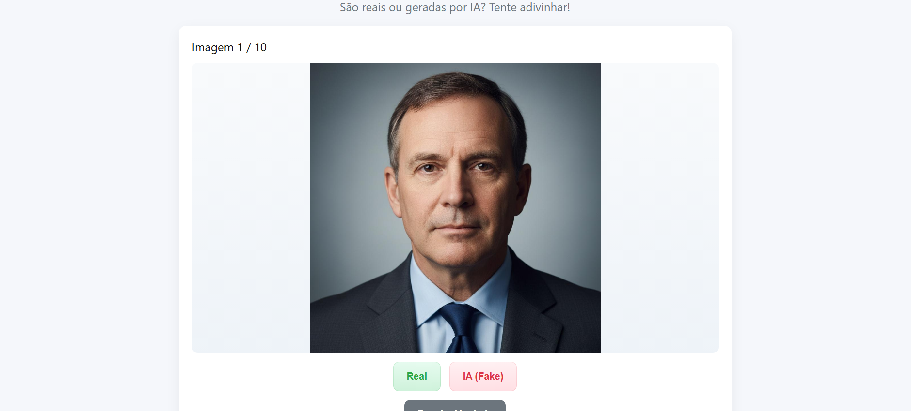

# 🧠 Natty or Not - IA Game

Um mini jogo interativo desenvolvido com **HTML, CSS e JavaScript**, onde o desafio é adivinhar se uma imagem é **real (natural)** ou **gerada por Inteligência Artificial (IA)**.  
Inspirado no desafio **“Natural or Fake Natty”** da DIO, este projeto explora o impacto das **IAs generativas** na criação de imagens realistas.

---

## Desktop


## Mobile


---

## 🎯 Objetivo

Testar sua percepção visual em um jogo rápido e educativo.  
Você verá **10 imagens**, sendo parte **reais** e parte **geradas por IA**.  
A cada imagem, tente adivinhar se ela é **real** ou **IA (fake)** — no final, veja seu desempenho e as respostas corretas!

---

## 🧩 Tecnologias Utilizadas

- **HTML5** → estrutura da página  
- **CSS3** → estilização responsiva e moderna  
- **JavaScript (ES6)** → lógica do jogo e interatividade  
- **[IA Geradora de Imagens]** → para criar as imagens falsas  
  - Exemplos de IA usadas: *Gemini*

---

## 🖼️ Estrutura de Pastas
.

    ├── natty-or-not-ai-game

            ├── index.html

            ├── style.css

            ├── script.js

            └── assets/
        ...

---

## ⚙️ Como Executar o Projeto

1. **Clone o repositório**
   ```bash
   git clone https://github.com/PedroHenri10/Natural-ou-Fake-Natty-IA-Game
Abra o arquivo index.html diretamente no navegador.

Não é necessário servidor nem instalação adicional.

Jogue!

Clique em “Real” ou “IA (Fake)” para cada imagem.

Veja o feedback imediato.

Ao final, o jogo mostra quantos acertos e erros você teve.

## 🎨 Design 
O layout foi criado com foco em:

- Responsividade (funciona bem no celular)

- Feedback visual imediato

- Interface limpa e minimalista

## 🧠 Como as Imagens Foram Criadas
Foram usadas ferramentas de IA generativa para produzir as imagens falsas.
Exemplo de prompt utilizado no Gemini:

“Photo-realistic portrait of a person, studio lighting, detailed skin texture, realistic facial proportions, 85mm lens —v 5 —ar 3:4”

As imagens reais foram selecionadas de bancos de imagens livres como Pexels.


## 💬 Reflexão
Criar algo “Natty or Not” demonstra o poder e o risco das IAs generativas: quanto mais realistas ficam, mais desafiador é distinguir o que é natural.
Este projeto mostra como a criatividade humana e a tecnologia podem se unir para educação e diversão.

## 👨‍💻 Autor: Pedro Henrique

💼 Projeto criado para portfólio e prática de desenvolvimento Front-end.

📧 Contato: [dinhonoliver@gmail.com]

🌐 Linkedin:  https://www.linkedin.com/in/p-henrique-nunes

